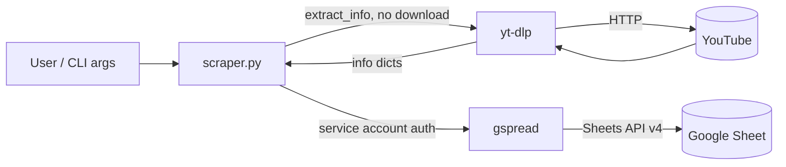
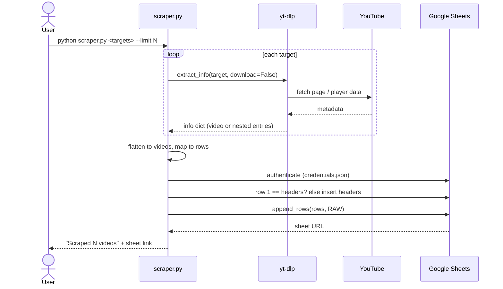
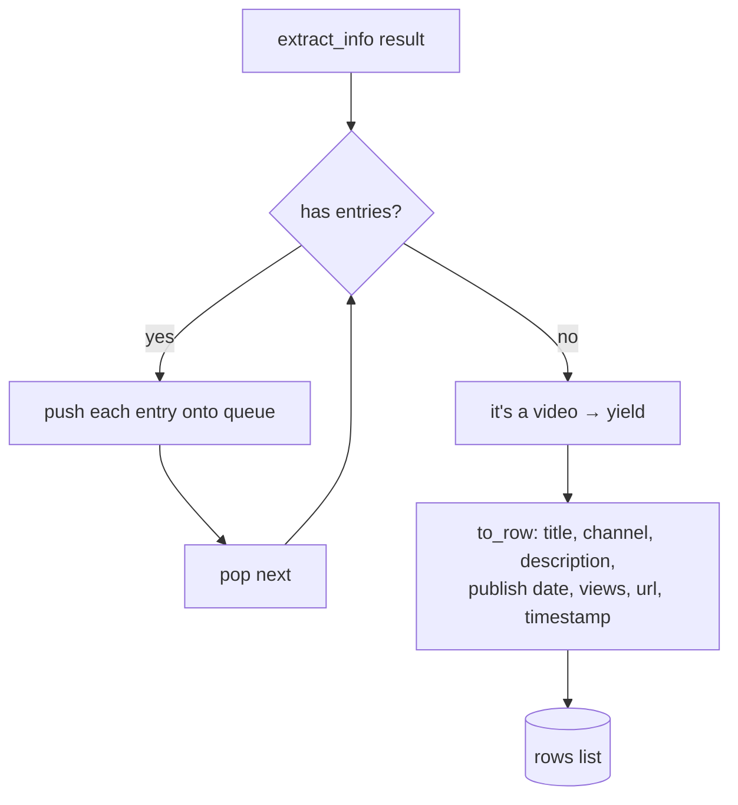
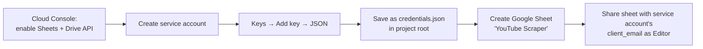
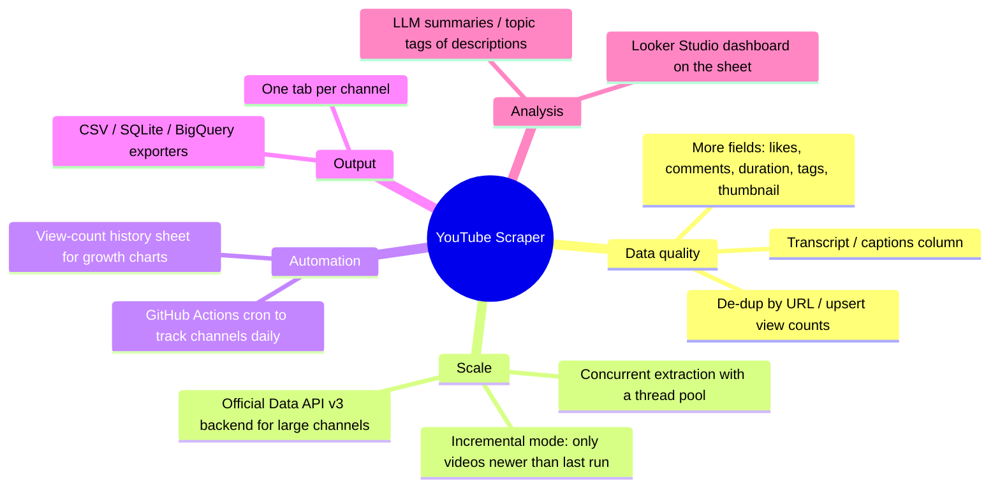

# YouTube Scraper → Google Sheets

Scrape video metadata from YouTube (single videos, whole channels, playlists, or search results) and append it as structured rows to a Google Sheet. No YouTube API key or quota needed.

| Title | Channel | Description | Publish Date | Views | URL | Scraped At |
|---|---|---|---|---|---|---|
| Never Gonna Give You Up… | Rick Astley | The official video for… | 2009-10-25 | 1823460273 | https://www.youtube.com/watch?v=dQw4w9WgXcQ | 2026-10-05T14:02:11 |

## Features

- **Any YouTube source**: video URL, channel URL, playlist URL, or a search (`ytsearchN:query`)
- **No API key**: metadata comes from [yt-dlp](https://github.com/yt-dlp/yt-dlp), so there are no Data API quotas
- **Google Sheets output**: one row per video with a header row, appended in a single batch call
- **Safe writes**: values are written `RAW`, so a title starting with `=` stays text and can't run as a formula. Descriptions are cut to fit the Sheets cell limit.
- **Small**: about 70 lines of Python with two dependencies

## How it works

### Architecture



### Run sequence



### Flattening channels and playlists

A channel URL returns nested results: the channel contains tabs (Videos, Shorts, Live), and each tab contains videos. The scraper goes through them breadth-first until only individual videos are left:



### Field mapping

| Sheet column | yt-dlp field | Notes |
|---|---|---|
| Title | `title` | |
| Channel | `channel` (fallback `uploader`) | |
| Description | `description` | cut to 49k chars (the Sheets cell limit is 50k) |
| Publish Date | `upload_date` | `YYYYMMDD` → ISO `YYYY-MM-DD` |
| Views | `view_count` | |
| URL | `webpage_url` | |
| Scraped At | — | local timestamp when the script runs |

## Setup

**1. Install**

```bash
git clone https://github.com/Sudhanshu-Patil/youtube-scraper.git
cd youtube-scraper
pip install -r requirements.txt
```

**2. Google credentials (one time)**



> `credentials.json` is gitignored. Never commit it, because anyone who has it can edit every sheet shared with that service account.

You can also keep the key somewhere else and point to it with `GOOGLE_CREDS=/path/to/key.json`.

## Usage

```bash
# single video
python scraper.py https://www.youtube.com/watch?v=dQw4w9WgXcQ

# latest 20 videos from a channel
python scraper.py https://www.youtube.com/@mkbhd/videos --limit 20

# top 10 search results, into a differently named sheet
python scraper.py "ytsearch10:python tutorial" --sheet "My Research"

# mix several sources in one run
python scraper.py <video-url> <playlist-url> "ytsearch5:lofi"
```

| Option | Default | Meaning |
|---|---|---|
| `targets` | — | one or more URLs or `ytsearchN:query` |
| `--sheet` | `YouTube Scraper` | name of the Google Sheet (it must already be shared with the service account) |
| `--limit` | `20` | maximum videos taken from each channel or playlist |

## Limitations

- **Re-runs add duplicates**: running on the same video twice adds two rows. See the de-duplication item under Future scope.
- **Speed**: the full details for each video are fetched one by one, so a 500-video channel takes several minutes.
- **yt-dlp needs updating**: when YouTube changes its site, yt-dlp sometimes breaks until a new release. Run `pip install -U yt-dlp` if scraping starts failing.
- The warning `No supported JavaScript runtime` affects video *format* (download) extraction only. Metadata is unaffected.

## Future scope



| Idea | Why it's useful | Effort |
|---|---|---|
| **De-dup / upsert by URL** | re-runs update view counts instead of adding duplicate rows | small |
| **Scheduled tracking (GitHub Actions cron)** | daily snapshots give view-growth curves per video | small (store the key as a repo secret) |
| **Extra fields** (likes, comments, duration, tags, thumbnail) | already in the yt-dlp info dict, so it's mostly column mapping | small |
| **Concurrency** | 5–10× faster on big channels | medium |
| **Transcripts** | full-text search and LLM summarisation | medium |
| **YouTube Data API v3 backend** | faster and more stable for bulk channel scrapes, at the cost of a quota | medium |

## Project structure

```
youtube-scraper/
├── scraper.py         # CLI: scrape → flatten → rows → Google Sheets
├── requirements.txt   # yt-dlp, gspread
├── .gitignore         # keeps credentials.json out of git
├── LICENSE
└── README.md
```

## Disclaimer

For personal research and educational use. Respect YouTube's Terms of Service and rate limits, and don't use scraped data in ways that break them.

## License

MIT
